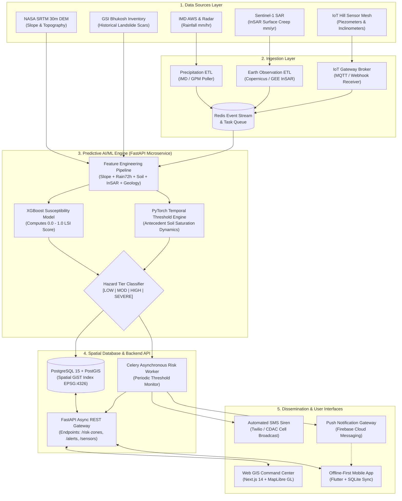

# 🏛️ System Architecture: NER Landslide Early Warning & Risk Monitoring System
> **Smart India Hackathon 2026 | Problem ID: SIH26001**  
> **Ministry of Development of North Eastern Region (MDoNER)**  
> **Pipeline**: Data Sources $\rightarrow$ Ingestion Layer $\rightarrow$ ML Engine $\rightarrow$ PostGIS / API $\rightarrow$ Dashboard + Mobile + Alerts

---

## 1. High-Level ASCII System Architecture

```text
+---------------------------------------------------------------------------------------------------+
|                                        1. DATA SOURCES                                            |
|  [IMD AWS & Radar]      [Sentinel-1 InSAR]      [NASA SRTM DEM]     [GSI Landslides]     [IoT Mesh]   |
|  (Rainfall / Clouds)   (Surface Creep mm/yr)    (Slope / Aspect)     (Historical Scars)  (Tilt/Piezos)|
+-----------------------------------+---------------------------------------+-----------------------+
                                    |
                                    v
+---------------------------------------------------------------------------------------------------+
|                                     2. INGESTION LAYER                                            |
|  +---------------------------+  +-------------------------------+  +---------------------------+  |
|  |    Weather Telemetry      |  |     Satellite SAR / Optical   |  |     In-Situ IoT Gateway   |  |
|  |  Hourly IMD Poller / GPM  |  |  Copernicus / GEE InSAR ETL   |  |  MQTT / LoRaWAN Broker    |  |
|  +-------------+-------------+  +---------------+---------------+  +-------------+-------------+  |
|                |                                |                                |                |
|                +--------------------------------+--------------------------------+                |
|                                                 |                                                 |
|                                                 v                                                 |
|                                [Redis Ingestion Event Stream]                                     |
+-------------------------------------------------+-------------------------------------------------+
                                                  |
                                                  v
+---------------------------------------------------------------------------------------------------+
|                                       3. AI / ML ENGINE                                           |
|  +---------------------------------------------------------------------------------------------+  |
|  | Feature Engineering: [Norm Slope, Antecedent 72h Rain, Soil Saturation, Lithology, InSAR]   |  |
|  +----------------------------------------------+----------------------------------------------+  |
|                                                 |                                                 |
|        +----------------------------------------+---------------------------------------+         |
|        v                                                                                v         |
|  [XGBoost Gradient Boosting]                                                  [PyTorch LSTM / GRU]|
|  Spatial Susceptibility Index (LSI: 0.0 - 1.0)                                Dynamic Rain Trigger|
|  Hazard Class: [LOW | MODERATE | HIGH | SEVERE]                               Intensity-Duration  |
+-------------------------------------------------+-------------------------------------------------+
                                                  |
                                                  v
+---------------------------------------------------------------------------------------------------+
|                                     4. POSTGIS & BACKEND API                                      |
|  +----------------------------------------------+  +-------------------------------------------+  |
|  |      PostgreSQL 15 + PostGIS Database        |  |          FastAPI Async REST Gateway       |  |
|  |  * Spatial GiST Indices (EPSG:4326)          |  |  * GeoJSON Exporters (/api/v1/risk-zones) |  |
|  |  * High-Risk Polygons & Evacuation Corridors |  |  * Real-time Telemetry (/api/v1/sensors)  |  |
|  |  * Safe Shelters & InSAR Historical Trends   |  |  * Disaster Dispatch (/api/v1/alerts)     |  |
|  +----------------------------------------------+  +---------------------+---------------------+  |
|                                                                          |                        |
|                     +----------------------------------------------------+                        |
|                     v                                                                             |
|            [Celery Asynchronous Worker & Redis Task Scheduler]                                    |
+---------------------+----------------------------------------------------+------------------------+
                      |                                                    |
         +------------+------------+                          +------------+------------+
         v                         v                          v                         v
+------------------+     +-------------------+      +-------------------+     +------------------+
|   5A. WEB GIS    |     |    5B. MOBILE     |      |  5C. SMS SIREN    |     |  5D. PUSH ALERTS |
|   COMMAND CENTER |     |  (OFFLINE-FIRST)  |      |   (CELL TOWER)    |     |   (FCM HIGH-PRI) |
| Next.js 14 +     |     | Flutter + SQLite  |      | CDAC / Twilio     |     | Firebase Cloud   |
| MapLibre GL 3D   |     | Local Shelter DB  |      | Rural 2G Network  |     | Instant Handset  |
| Interactive Map  |     | Emergency SOS     |      | Failover Siren    |     | Push Warnings    |
+------------------+     +-------------------+      +-------------------+     +------------------+
```

---

## 2. Mermaid System Architecture Diagram



---

## 3. Detailed Component & Pipeline Specifications

### Stage 1: Data Sources
- **Atmospheric**: Indian Meteorological Department (IMD) Automatic Weather Stations (AWS) provide real-time ground precipitation; NASA GPM IMERG delivers continuous gridded precipitation coverage over remote valleys.
- **Space-Borne Synthetic Aperture Radar (SAR)**: Sentinel-1 InSAR data tracks sub-centimeter surface slope displacement along major hill arteries (e.g., NH-10 Sikkim corridor, NH-106 Meghalaya).
- **Topography**: NASA SRTM 30m / Copernicus GLO-30 Digital Elevation Model calculates ground slope angles ($\beta$), profile curvature, and hydrological flow accumulation.
- **Geotechnical**: Borehole piezometers track groundwater pore pressure; bi-axial tilt inclinometers detect sudden angular slope displacement.

### Stage 2: Ingestion Layer
- **Decoupled Data Fetchers**: Asynchronous background Python ETL jobs poll external APIs without blocking application traffic.
- **Resilient Redis Buffer**: All incoming raw telemetry packets are pushed into Redis event queues to handle peak load during cloudburst events without dropping telemetry packets.
- **Validation & Sanity Checks**: Incoming telemetry is validated against range limits (e.g., rainfall rate $0 \le r \le 300\text{ mm/hr}$) before feature ingestion.

### Stage 3: AI/ML Inference Microservice (`/ml-engine`)
- **Input Vector**:
  $$\vec{X} = [\text{Slope}^\circ,\, \text{Rain}_{72h},\, \text{SoilMoisture}\%,\, \text{LithologyWeight},\, \text{InSAR}_{\text{creep}}]$$
- **Inference Models**:
  - **XGBoost Ensemble**: Evaluates non-linear interactions between terrain slope, geological fault distance, and antecedent rainfall to predict the continuous **Landslide Susceptibility Index (LSI)** ($0.0 \le \text{LSI} \le 1.0$).
  - **Dynamic Moisture Threshold Filter**: Adjusts critical rainfall trigger limits dynamically based on 72-hour soil saturation.
- **Output Classification**:
  - `LSI < 0.35` $\rightarrow$ **LOW (Green)**
  - `0.35 <= LSI < 0.55` $\rightarrow$ **MODERATE (Yellow)**
  - `0.55 <= LSI < 0.75` $\rightarrow$ **HIGH (Orange)**
  - `LSI >= 0.75` $\rightarrow$ **SEVERE (Red)**

### Stage 4: PostGIS & Core API Layer (`/backend`)
- **PostGIS Spatial Modeling**: Stores hazard polygons and shelter points with spatial GiST indexing (`idx_landslide_zones_geom`). Supports sub-millisecond spatial queries (`ST_Intersects`, `ST_DWithin`).
- **FastAPI Asynchronous Gateway**: Serves OGC-compliant GeoJSON FeatureCollections, telemetry streams, and emergency alert endpoints.
- **Celery & Redis Worker**: Runs continuous threshold-checking tasks in the background. When an alert threshold is breached, Celery queues instant dispatch tasks without slowing down web API performance.

### Stage 5: Dissemination & User Interfaces
- **Web GIS Dashboard (`/frontend`)**: Next.js 14 application with MapLibre GL rendering hazard zones, rainfall radar layers, and sensor nodes.
- **Offline-First Mobile App (`/mobile`)**: Flutter application with local SQLite database (`sqflite`). Pre-caches all safe shelters, emergency routes, and first-aid instructions for zero-connectivity scenarios.
- **Telecom SMS Gateway**: CDAC / Twilio integration for automated emergency SMS sirens to feature phones and smartphones when data connectivity is down.
- **Firebase Push Service**: Dispatches high-priority push notifications with actionable evacuation route guidance.
